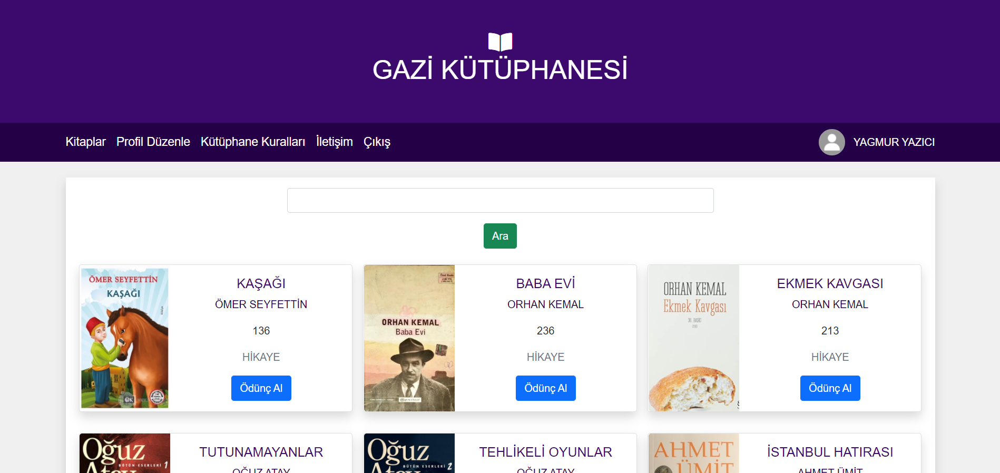

# GaziLibrary
Database Management Systems Project

## Using
- Asp.Net Core
- Oracle
- C#
- MVC
- Bootstrap
- EntityFramework
- Html,Css,Js

## Project's Youtube Video

  

## Database Tables

  
Details

### Books

| Name          | Data Type    | Allow Nulls | Default |
| :------------ | :----------- | :---------- | :------ |
| Id            | int          | False       |         |
| AuthorId      | int          | False       |         |
| TypeId        | int          | False       |         |
| Name          | nvarchar(50) | False       |         |
| NumberOfPage  | int          | False       |         |
| Image         | nvarchar(90) | False       |         |
| Status        | bit          | False       |         |

### Types

| Name   | Data Type     | Allow Nulls | Default |
| :----- | :------------ | :---------- | :------ |
| Id     | int           | False       |         |
| Name   | nvarchar(50)  | False       |         |
| Status | bit           | False       |         |

### Authors

| Name       | Data Type     | Allow Nulls | Default |
| :--------- | :------------ | :---------- | :------ |
| Id         | int           | False       |         |
| FirstName  | nvarchar(50)  | False       |         |
| LastName   | nvarchar(50)  | False       |         |
| Status     | bit           | False       |         |

### BorrowedBooks

| Name       | Data Type | Allow Nulls | Default |
| :--------- | :-------- | :---------- | :------ |
| Id         | int       | False       |         |
| UserId     | int       | False       |         |
| BookId     | int       | False       |         |
| BorrowDate | Date      | False       |         |
| ReturnDate | Date      | False       |         |
| Status     | bit       | False       |         |

### Messages

| Name    | Data Type     | Allow Nulls | Default |
| :------ | :------------ | :---------- | :------ |
| Id      | int           | False       |         |
| UserId  | int           | False       |         |
| Message | nvarchar(MAX) | False       |         |
| Date    | Date          | False       |         |

### Users

| Name       | Data Type    | Allow Nulls | Default |
| :--------- | :----------- | :---------- | :------ |
| Id         | int          | False       |         |
| PositionId | int          | False       |         |
| FirstName  | nvarchar(50) | False       |         |
| LastName   | nvarchar(50) | False       |         |
| UserName   | nvarchar(50) | False       |         |
| Email      | nvarchar(50) | False       |         |
| Password   | nvarchar(50) | False       |         |
| Status     | bit          | False       |         |

### Positions

| Name   | Data Type    | Allow Nulls | Default |
| :----- | :----------- | :---------- | :------ |
| Id     | int          | False       |         |
| Name   | varchar(50)  | False       |         |
| Status | bit          | False       |         |

